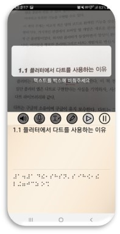
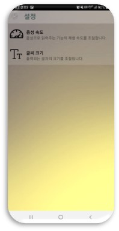

# Capstone_Real-time_Braille_Scanner
## 2022-2 중앙대학교 캡스톤디자인 프로젝트
### 4조 - 실점(실시간 점자) 조
--------------------
### 목차

[0. 팀원 소개](#0-팀원-소개)

[1. 서비스 소개](#1-서비스-소개)

[2. 기술 스택](#2-기술-스택)

[3. 설계 디자인](#3-설계-디자인)

[4. 세부 기능](#4-세부-기능)

[5. 스케줄](#5-스케줄)

--------------------------

## 0. 팀원 소개
* 노현진 (20183784) :  서버 구축, 이미지 분석 알고리즘 적용, 점자 -> 한글 구현
* 이강은 (20173318) :  STT/TTS 적용, 앱 디자인, 프로젝트 발표
* 정현규 (20186984) :  한글 점자간 변환 알고리즘 구현, 프론트엔드 구현, 한글 -> 점자 구현

-----------
## 1. 서비스 소개

> 실시간 점자 번역 서비스

한글과 점자 간의 번역을 실시간으로 수행하여 사용자로 하여금 한글과 점자를 비교하여 학습할 수 있게 돕는 어플리케이션 서비스입니다. 

기존에 점자와 한글에 관련된 어플리케이션은 여러 개 있었지만, 한글과 점자를 직접 타이핑하거나 그리지 않고 실시간으로 빠르게 변환시켜주는
어플리케이션은 없었습니다. 이에, 이 부분에서의 불편함을 없애고 편리성을 극대화하기 위해 실시간 점자 번역 서비스를 제공하기로 하였습니다.

### 1.1. 서비스 대상

* **시각장애인 활동지원사**

  전맹인 시각장애인에게 점자 교육을 제공하고자 하지만 점자에 대한 지식이 많지 않은 활동지원사, 가족 등 

* **저시력 시각장애인**

  사물의 유무 정도는 분간할 수 있지만 시력이 낮아 글자를 읽는 데에는 한계가 있어 점자를 배울 필요가 있는 저시력 시각장애인
  
* **실명 질환 환자**

  시력이 남아 있지만 백내장, 녹내장, 황반변성 등 시력을 점차 잃어가게 되는 질병에 걸린 진행형 시각장애인
  
  
  
### 1.2. 주요 기능

#### 1.2.1. 한글을 점자로 번역하는 기능

1. 사용자가 한글로 된 텍스트를 카메라로 비추면, 하단에 점자로 표시되어 번역 결과가 나타납니다.
2. 국립 국어원에서 지정한 형식에 맞추어 실제 용례와 동일하게 번역됩니다. 

#### 1.2.2. 점자를 한글로 번역하는 기능

1. 사용자가 점자로 된 텍스트를 카메라로 비추면, 하단에 한글로 표시되어 번역 결과가 나타납니다.
2. 국립 국어원에서 지정한 형식에 맞추어 실제 용례와 동일하게 번역됩니다. 

#### 1.2.3. 환경설정 기능

1. 음성의 출력 속도를 조절할 수 있습니다.
2. 표시되는 텍스트의 크기를 조절할 수 있습니다.

-----------

## 2. 기술 스택

### 2.1. 데이터 학습

> 이미지 기반으로 점자 번역 데이터를 학습시킨 모델을 사용했습니다.

* Python 3.9

  1. 토치를 이용해서 데이터를 학습시키는 데에 효과적인 언어인 python을 사용했습니다.

* Torch

  1. 점자 인식 데이터들을 Torch를 통해 이미지 기반으로 학습시켜 모델을 구축했습니다.
  2. 현재 널리 사용중인 PyTorch의 근간이 되는 모델입니다.

### 2.2. 백엔드

* Python 3.9

  1. 토치를 이용해서 데이터를 학습시키는 데에 효과적인 언어입니다. 
  2. Flask를 이용한 웹 서버 구축에 효과적입니다.

* Flask Library

  1. 이미지 내의 점자 인식 라이브러리를 앱에서 사용하기 위해 Flask를 사용하였습니다. 
  2. 코드가 비교적 단순하고 Restful API를 구축하는 데에 효과적입니다. 
  3. 다양한 웹 엔진과 호환성이 높습니다.

* ML Kit

  1. 한글을 촬영할 때 이를 인식하여 텍스트 형태로 전환하기 위해, 구글에서 제공하는 ML Kit의 com.google.mlkit:text-recognition-korean 라이브러리를 사용하였습니다.
  2. Android와의 호환성이 높기 때문에 앱 개발에 효과적입니다. 

### 2.3. 프론트엔드

* Kotlin

  1. 코틀린 언어를 이용해서 프론트엔드 개발을 진행하였습니다.
  2. JAVA보다 더 간결한 문장과 다양한 기능을 제공하는 언어입니다.
  3. 안드로이드 개발 환경에서 가장 널리 쓰이는 언어입니다.

* Camera X

  1. 카메라 앱 개발을 쉽게 하기 위해 개발된 Jetpack 라이브러리입니다.
  2. 한글과 점자 간의 실시간 번역을 위한 input image로 사용됩니다.

* Google Text-To-Speech API

  1. 한글로 쓰여진 내용을 음성으로 출력해주는 안드로이드 엔진입니다.
  2. 추가로 STT 기능도 탑재하여 음성을 한글로 출력하는 기능도 구현되었습니다.

### 2.4. 배포

* AWS EC2

  1. 서버에서 자동적으로 트래픽을 관리하기 때문에 사용이 효과적입니다.
  2. 실무에서 가장 널리 쓰이는 클라우드 컴퓨팅 서비스입니다.
  3. 목적에 따라 다양한 서비스와 라이브러리를 제공합니다.

### 2.4. 프로젝트 관리

* Github

  1. Github 환경에서 작업물을 실시간으로 공유하며 작업하였습니다. 
  2. 코드 수정 내용을 효과적으로 파악할 수 있어, 유동적으로 작업할 수 있습니다. 

-----------

## 3. 설계 디자인

### 3.1. 한글 -> 점자

> 디자인 설계도의 위쪽 부분입니다.
  1. 안드로이드 SDK로 프로젝트가 구성되어 있습니다.
  2. Camera X 라이브러리로 촬영 기능을 활성화합니다.
  3. ML Kit API가 촬영된 이미지에서 문자를 읽어옵니다.
  4. 알고리즘에 따라 문자가 점자로 번역되어 출력됩니다.
  5. 출력 방법은 텍스트와 음성입니다.

### 3.2. 점자 -> 한글

> 디자인 설계도의 아래쪽 부분입니다. 
  1. 안드로이드 SDK로 프로젝트가 구성되어 있습니다.
  2. Camera X 라이브러리로 촬영 기능을 활성화합니다.
  3. 서버에서 이미지를 읽어 점자 데이터를 추출합니다.
  4. 알고리즘에 따라 점자가 한글로 번역되어 출력됩니다.
  5. 출력 방법은 텍스트입니다.

--------
## 4. 세부 기능

### 4.1. 음성 출력

> 
  1. 텍스트 창에 쓰여 있는 글을 음성으로 출력하여 읽어줍니다. 
  2. 한글을 점자로 번역할 때와 점자를 한글로 번역할 때 모두 사용 가능합니다.
  3. 저시력 시각장애인이 사용하기에 유용합니다. 

### 4.2. 음성 입력

> 
  1. 사용자로부터 음성을 입력받고 이를 텍스트로 변환하여 등록해 줍니다.
  2. 음성을 입력받는 중에도 입력된 텍스트가 실시간으로 보여집니다.

### 4.3. 하이라이트

> 
  1. 한글을 클릭하면, 대응하는 점자가 강조되어 나타납니다.
  2. 어떤 단어가 어떤 단어에 대응하는지 쉽게 파악할 수 있습니다.
  3. 여러 단어를 동시에 선택해서 확인할 수 있습니다. 

### 4.4. 텍스트 수정

> 
  1. 텍스트를 수정하여 다른 내용을 점자로 확인해볼 수 있습니다.
  2. 텍스트를 수정하는 중에도 실시간으로 점자의 번역이 반영됩니다.

### 4.5. 번역 재생

> 
  1. 재생 버튼을 눌러 번역을 진행할 수 있습니다.
  2. 이 버튼이 활성화되면, 카메라에 나타난 문자나 점자가 실시간으로 인식됩니다.

### 4.6. 번역 일시정지

> 
  1. 일시정지 버튼을 눌러 번역을 중지할 수 있습니다.
  2. 번역을 원치 않는 경우에도 실시간으로 번역이 반영되는 것을 방지할 수 있습니다.
  3. 사용하지 않는 동안 앱의 동작을 제한하여 자원 낭비를 막을 수 있습니다. 

----------
## 5. 스케줄

