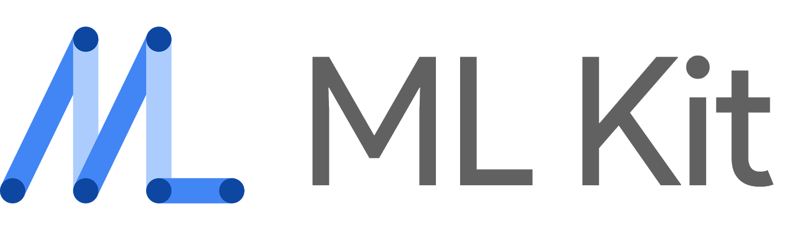

# Capstone_Real-time_Braille_Scanner
--------------------------
## 2022-2 중앙대학교 캡스톤디자인 프로젝트
##### 노현진(20183784) 이강은(20173318) 정현규(20186984)
--------------------------

* 노현진 : 서버 구축, 이미지 분석 알고리즘 적용, 점자 -> 한글 구현
* 이강은 : STT/TTS 적용, 앱 디자인, 프로젝트 발표
* 정현규 : 한글 점자간 변환 알고리즘 구현, 프론트엔드 구현, 한글 -> 점자 구현

## 1. 서비스 소개

> 실시간 점자 번역 서비스

한글과 점자 간의 번역을 실시간으로 수행하여 사용자로 하여금 한글과 점자를 비교하여 학습할 수 있게 돕는 어플리케이션 서비스입니다. 

### 1.1. 서비스 대상

* **시각장애인 활동지원사**

  전맹인 시각장애인에게 점자 교육을 제공하고자 하지만 점자에 대한 지식이 많지 않은 활동지원사, 가족 등 

* **저시력 시각장애인**

  사물의 유무 정도는 분간할 수 있지만 시력이 낮아 글자를 읽는 데에는 한계가 있어 점자를 배울 필요가 있는 저시력 시각장애인
  
* **실명 질환 환자**

  시력이 남아 있지만 백내장, 녹내장, 황반변성 등 시력을 점차 잃어가게 되는 질병에 걸린 진행형 시각장애인
  
  
  
### 1.2. 주요 기능

#### 1.2.1. 한글을 점자로 번역하는 기능

1. 사용자가 한글로 된 텍스트를 카메라로 비추면, 하단에 점자로 표시되어 번역 결과가 나타납니다.
2. 국립 국어원에서 지정한 형식에 맞추어 실제 용례와 동일하게 번역됩니다. 

#### 1.2.2. 점자를 한글로 번역하는 기능

1. 사용자가 점자로 된 텍스트를 카메라로 비추면, 하단에 한글로 표시되어 번역 결과가 나타납니다.
2. 국립 국어원에서 지정한 형식에 맞추어 실제 용례와 동일하게 번역됩니다. 

#### 1.2.3. 환경설정 기능

1. 음성의 출력 속도를 조절할 수 있습니다.
2. 표시되는 텍스트의 크기를 조절할 수 있습니다.

## 2. 기술 스택

### 2.1. 데이터 학습

> 이미지 기반으로 점자 번역 데이터를 학습시킨 모델을 사용했습니다.

* Python 3.9

  1. 토치를 이용해서 데이터를 학습시키는 데에 효과적인 언어인 python을 사용했습니다.

* Torch

  1. 점자 인식 데이터들을 Torch를 통해 이미지 기반으로 학습시켜 모델을 구축했습니다.
  2. 현재 널리 사용중인 PyTorch의 근간이 되는 모델입니다.

### 2.2. 백엔드

* Python 3.9

  1. 토치를 이용해서 데이터를 학습시키는 데에 효과적인 언어입니다. 
  2. Flask를 이용한 웹 서버 구축에 효과적입니다.

* Flask Library

  1. 이미지 내의 점자 인식 라이브러리를 앱에서 사용하기 위해 Flask를 사용하였습니다. 
  2. 코드가 비교적 단순하고 Restful API를 구축하는 데에 효과적입니다. 
  3. 다양한 웹 엔진과 호환성이 높습니다.

* ML Kit

  1. 한글을 촬영할 때 이를 인식하여 텍스트 형태로 전환하기 위해, 구글에서 제공하는 ML Kit의 com.google.mlkit:text-recognition-korean 라이브러리를 사용하였습니다.
  2. Android와의 호환성이 높기 때문에 앱 개발에 효과적입니다. 

### 2.3. 프론트엔드

* Camera X

  1. 타입스크립트는 자바스크립트의 수퍼셋으로, 코드의 가독성과 생산성을 높여줍니다.
  2. 라이브러리 등에서 직접 지원하는 경우가 많습니다.
  3. 산업군에서 많이 채택하고 있는 환경입니다.

* React.js

  

  1. Vue와 함께 최고 점유율 라이브러리
  2. 강력한 상태관리와 타입스크립트 친화적 환경

* Redux

* Materialize

  

  1. 컴포넌트 단순함
  2. css 전처리기가 없어서 커스터마이징 자유도 높음

### 2.4. 배포

* AWS EC2
* Docker
* Nginx

### 2.4. 프로젝트 관리

* Git
* Notion
* Jira
